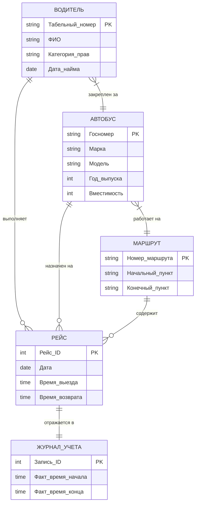

```mermaid
erDiagram
    ВОДИТЕЛЬ {
        string Табельный_номер PK
        string ФИО
        string Категория_прав
        date Дата_найма
    }

    АВТОБУС {
        string Госномер PK
        string Марка
        string Модель
        int Год_выпуска
        int Вместимость
    }

    МАРШРУТ {
        string Номер_маршрута PK
        string Начальный_пункт
        string Конечный_пункт
    }

    РЕЙС {
        int Рейс_ID PK
        date Дата
        time Время_выезда
        time Время_возврата
    }

    ЖУРНАЛ_УЧЕТА {
        int Запись_ID PK
        time Факт_время_начала
        time Факт_время_конца
    }

    ВОДИТЕЛЬ ||--o{ РЕЙС : "выполняет"
    АВТОБУС ||--o{ РЕЙС : "назначен на"
    МАРШРУТ ||--o{ РЕЙС : "содержит"
    РЕЙС ||--|| ЖУРНАЛ_УЧЕТА : "отражается в"
    ВОДИТЕЛЬ }|--|| АВТОБУС : "закреплен за"
    АВТОБУС }|--|| МАРШРУТ : "работает на"
```
