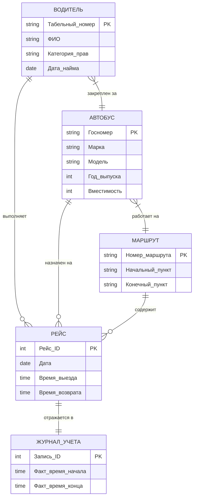
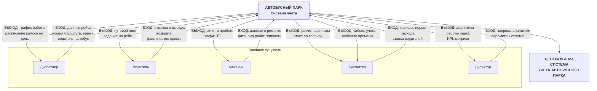
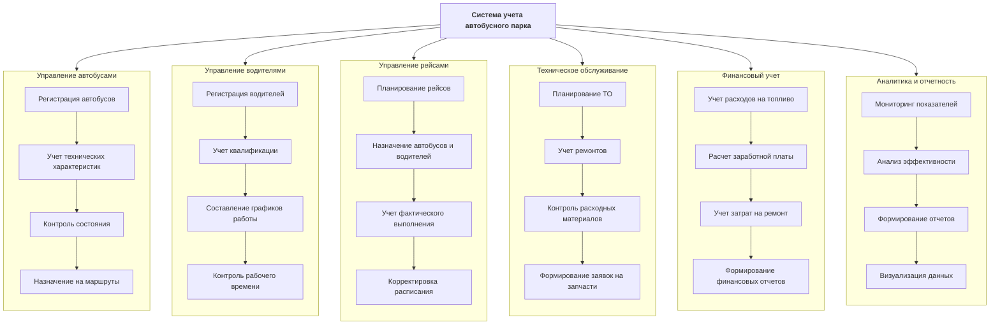

```mermaid
erDiagram
    ВОДИТЕЛЬ {
        string Табельный_номер PK
        string ФИО
        string Категория_прав
        date Дата_найма
    }

    АВТОБУС {
        string Госномер PK
        string Марка
        string Модель
        int Год_выпуска
        int Вместимость
    }

    МАРШРУТ {
        string Номер_маршрута PK
        string Начальный_пункт
        string Конечный_пункт
    }

    РЕЙС {
        int Рейс_ID PK
        date Дата
        time Время_выезда
        time Время_возврата
    }

    ЖУРНАЛ_УЧЕТА {
        int Запись_ID PK
        time Факт_время_начала
        time Факт_время_конца
    }

    ВОДИТЕЛЬ ||--o{ РЕЙС : "выполняет"
    АВТОБУС ||--o{ РЕЙС : "назначен на"
    МАРШРУТ ||--o{ РЕЙС : "содержит"
    РЕЙС ||--|| ЖУРНАЛ_УЧЕТА : "отражается в"
    ВОДИТЕЛЬ }|--|| АВТОБУС : "закреплен за"
    АВТОБУС }|--|| МАРШРУТ : "работает на"
```
**Контекстная диаграмма**

```mermaid
flowchart TD
    %% Определяем внешние сущности (прямоугольники)
    A[<b>АВТОБУСНЫЙ ПАРК<br/>Система учета</b>] --> System
    
    subgraph External[Внешние сущности]
        direction LR
        Dispatcher[Диспетчер]
        Driver[Водитель]
        Mechanic[Механик]
        Accountant[Бухгалтер]
        Director[Директор]
    end
    
    %% Входные потоки (слева)
    Dispatcher -->|"ВХОД: данные рейса<br/>номер маршрута, время,<br/>водитель, автобус"| A
    Driver -->|"ВХОД: отметка о выезде/возврате<br/>фактическое время"| A
    Mechanic -->|"ВХОД: данные о ремонте<br/>дата, вид работ, запчасти"| A
    
    %% Выходные потоки (справа)
    A -->|"ВЫХОД: график работы<br/>расписание рейсов на день"| Dispatcher
    A -->|"ВЫХОД: путевой лист<br/>задание на рейс"| Driver
    A -->|"ВЫХОД: отчет о пробеге<br/>график ТО"| Mechanic
    A -->|"ВЫХОД: расчет зарплаты<br/>отчет по топливу"| Accountant
    A -->|"ВЫХОД: аналитика работы парка<br/>KPI, метрики"| Director
    
    %% Центральная система
    System[<b>ЦЕНТРАЛЬНАЯ СИСТЕМА<br/>УЧЕТА АВТОБУСНОГО ПАРКА</b>]
    
    %% Дополнительные входы/выходы
    Accountant -->|"ВХОД: тарифы, нормы расхода<br/>ставки водителей"| A
    A -->|"ВЫХОД: табель учета рабочего времени"| Accountant
    Director -->|"ВХОД: запросы аналитики<br/>параметры отчетов"| A
```
**Диаграмма декомпозиций функций**

```mermaid
flowchart TD
    %% Корневой уровень
    System[<b>Система учета автобусного парка</b>]
    
    System --> Func1[Управление автобусами]
    System --> Func2[Управление водителями]
    System --> Func3[Управление рейсами]
    System --> Func4[Техническое обслуживание]
    System --> Func5[Финансовый учет]
    System --> Func6[Аналитика и отчетность]
    
    %% Декомпозиция функции 1: Управление автобусами
    subgraph Func1[Управление автобусами]
        direction TB
        F1_1[Регистрация автобусов] --> F1_2
        F1_2[Учет технических характеристик] --> F1_3
        F1_3[Контроль состояния] --> F1_4
        F1_4[Назначение на маршруты]
    end
    
    %% Декомпозиция функции 2: Управление водителями
    subgraph Func2[Управление водителями]
        direction TB
        F2_1[Регистрация водителей] --> F2_2
        F2_2[Учет квалификации] --> F2_3
        F2_3[Составление графиков работы] --> F2_4
        F2_4[Контроль рабочего времени]
    end
    
    %% Декомпозиция функции 3: Управление рейсами
    subgraph Func3[Управление рейсами]
        direction TB
        F3_1[Планирование рейсов] --> F3_2
        F3_2[Назначение автобусов и водителей] --> F3_3
        F3_3[Учет фактического выполнения] --> F3_4
        F3_4[Корректировка расписания]
    end
    
    %% Декомпозиция функции 4: Техническое обслуживание
    subgraph Func4[Техническое обслуживание]
        direction TB
        F4_1[Планирование ТО] --> F4_2
        F4_2[Учет ремонтов] --> F4_3
        F4_3[Контроль расходных материалов] --> F4_4
        F4_4[Формирование заявок на запчасти]
    end
    
    %% Декомпозиция функции 5: Финансовый учет
    subgraph Func5[Финансовый учет]
        direction TB
        F5_1[Учет расходов на топливо] --> F5_2
        F5_2[Расчет заработной платы] --> F5_3
        F5_3[Учет затрат на ремонт] --> F5_4
        F5_4[Формирование финансовых отчетов]
    end
    
    %% Декомпозиция функции 6: Аналитика и отчетность
    subgraph Func6[Аналитика и отчетность]
        direction TB
        F6_1[Мониторинг показателей] --> F6_2
        F6_2[Анализ эффективности] --> F6_3
        F6_3[Формирование отчетов] --> F6_4
        F6_4[Визуализация данных]
    end
```
